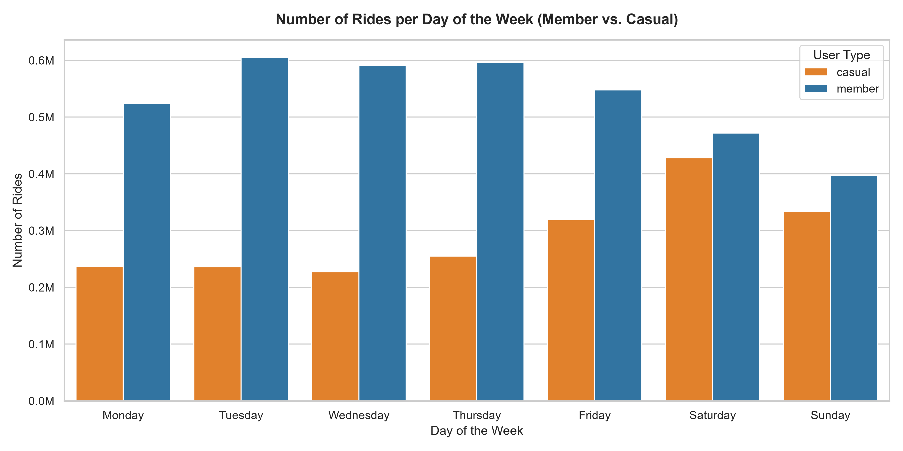
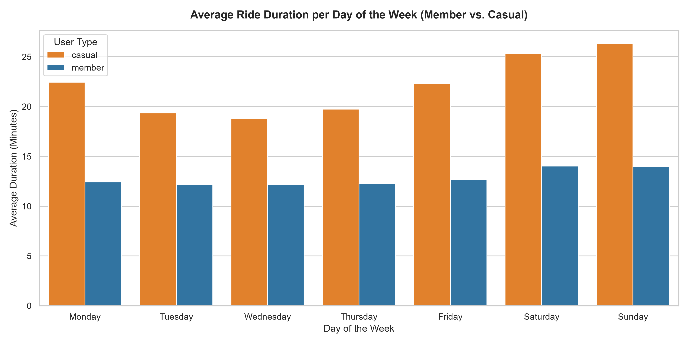
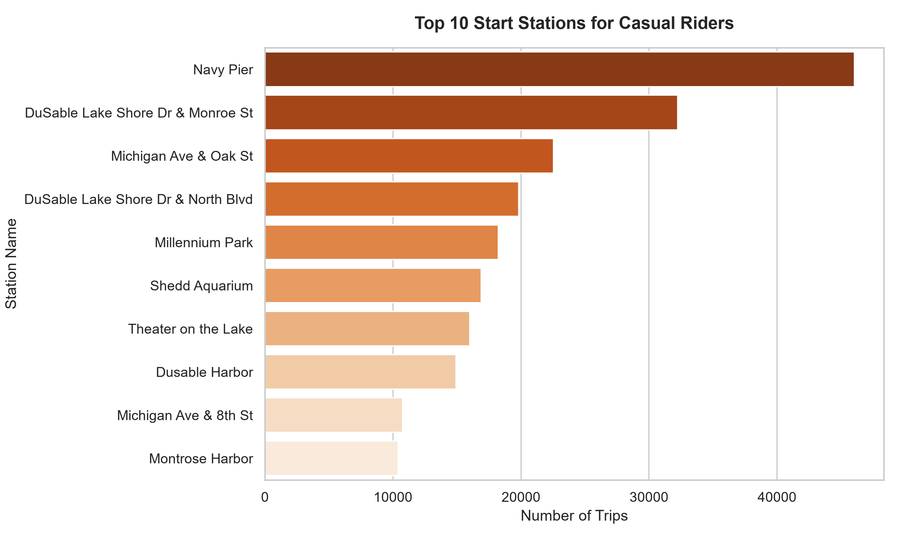
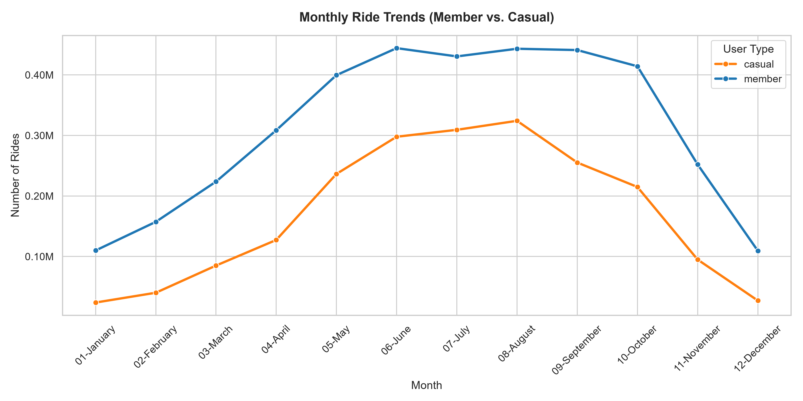

# Cyclistic Bike-Share Case Study: Analysis of Rider Behaviors
### Google Data Analytics Professional Certificate Capstone Project

---

## Project Structure
- `data/`: Contains extracted monthly CSV files.
- `notebooks/`: Contains the Jupyter Notebook for analysis.
- `scripts/`: Contains the download and PDF generation scripts.
- `reports/`: Contains the final presentation PDF.
- `reports/figures/`: Contains the generated analysis charts.
- `requirements.txt`: Python package dependencies.

---

## 1. Scenario & Business Task (Ask)
**Cyclistic** is a fictional bike-share company in Chicago. The director of marketing believes that the company's future success depends on maximizing the number of annual memberships. 

Our goal is to analyze historical bike-share data to identify trends and answer the question: **How do annual members and casual riders use Cyclistic bikes differently?**

The insights derived from this analysis will help the marketing team design a strategy to convert casual riders into annual members.

---

## 2. Data Sources & Environment Setup (Prepare)
We used Cyclistic's historical trip data from **July 2025 to June 2026** (12 months of public data). The data was retrieved from the public Amazon S3 bucket (`s3://divvy-tripdata`).

- **Original Dataset Size:** 12 CSV files containing approximately **5.93 million rows**.
- **Tools:** Python 3.12, VS Code, `pandas`, `numpy`, `matplotlib`, and `seaborn`.

---

## 3. Data Cleaning & Processing (Process)
The data was cleaned and processed to ensure accuracy:
1. **Datetime Conversion:** Standardized start and end times to datetimes.
2. **Calculations:** 
   - Computed `ride_length` in minutes (`ended_at` - `started_at`).
   - Extracted the `day_of_week` and `month_year` for each ride.
3. **Filtering:**
   - Removed trips shorter than 1 minute or with negative durations (docking checks and system errors).
- **Post-Cleaning Dataset Size:** **5,770,103 rows** (2.73% of erroneous rows removed).

---

## 4. Key Findings & Analysis (Analyze)

### Ride Volume Distribution
- **Annual Members:** **64.7%** (3,733,790 rides)
- **Casual Riders:** **35.3%** (2,036,313 rides)

### Average Trip Duration
- **Casual Riders:** **22.57 minutes**
- **Annual Members:** **12.73 minutes**
*Casual riders travel for almost twice as long per trip compared to members, indicating leisure or recreational usage.*

### Weekly Trip Distribution
- **Members:** Busiest on weekdays (peaking on Thursdays at ~595k trips) and dropping on weekends.
- **Casuals:** Busiest on weekends (peaking on Saturdays at ~428k trips) and dropping on weekdays.
*Members show commuting behaviors, while casuals show strong leisure behaviors.*

### Seasonality Trends
- **Casual Riders** show a massive spike during summer (June to August) with a steep decline in winter.
- **Members** show a more stable usage pattern throughout the year, although summer remains the peak.

---

## 5. Visualizations (Share)

### A. Weekly Activity (Number of Rides)
Annual members dominate weekdays (Monday to Friday), suggesting routine commutes. Casual riders peak on weekends.

### B. Average Trip Duration
Casual riders consistently ride longer than annual members every day of the week, with trip lengths peaking on weekends.

### C. Top 10 Start Stations for Casual Riders
Casual riders are heavily concentrated around waterfront areas and tourist spots, with Navy Pier being the most popular start location.

### D. Monthly Trends (Seasonality)
Both groups show seasonal variation, but casual riders are extremely sensitive to seasons, peaking in July/August and dropping to near-zero in winter.

---

## 6. Recommendations (Act)
Based on our findings, we propose three marketing strategies to convert casual riders into annual members:

1. **Weekend-Only or Leisure Annual Memberships:**
   Since casual riders are primarily active on weekends, introduce a discounted weekend-only annual membership to capture this specific user segment.
2. **"Long-Ride" Savings Campaigns:**
   Target casual riders by highlighting their average ride duration of 22 minutes. Run campaigns showing how much they would save annually compared to single-ride or day-pass fees.
3. **Targeted Promotions at Top Stations (Navy Pier, Waterfront):**
   Utilize physical stands, QR codes, and digital geofencing to display membership conversion ads directly at the top 10 casual rider stations.
4. **Summer Conversion Window:**
   Run high-intensity promotion campaigns from May to August, offering seasonal sign-up discounts when casual riders are most active.
